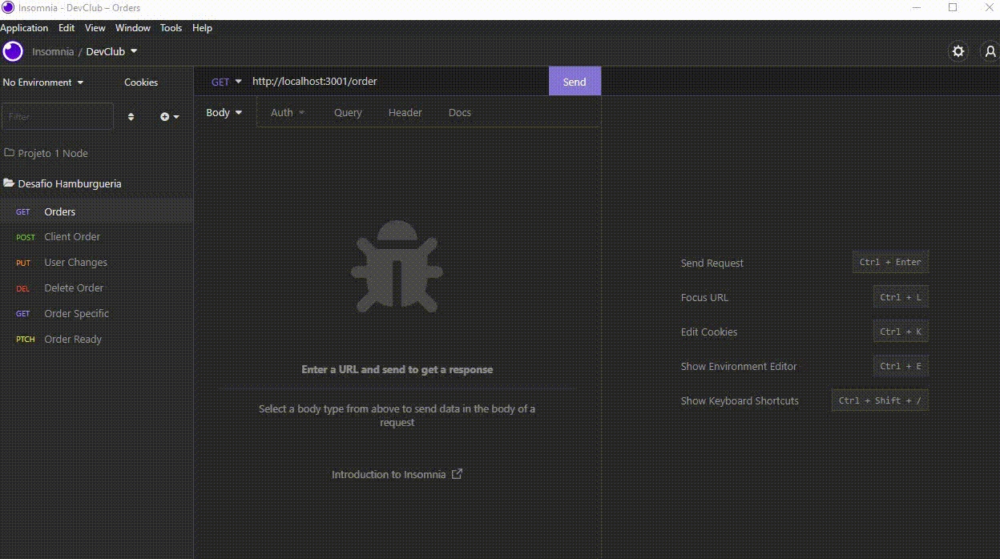

<h1 align="center">🍟 Dev's Burger Order</h1>



## :page_facing_up: Description

Burguer Order CRUD is a web application that allows users to create, read, update, and delete burger orders. Users can create new orders, view existing orders, modify orders, and remove orders from the system. The application also includes a login and registration system to secure user data. Burguer Order CRUD is built using React, Node.js, and MongoDB, making it scalable and efficient.

### Routes

- `POST /order`: This route receives the `customer's order`, `customer's name`, and `order value`, which are passed in the request body, and are placed inside an array.

- `GET /order`: Route that lists all orders already made.

- `PUT /order/:id`: This route changes an already made order.

- `DELETE /order/:id`: This route deletes an already made order with the `id` sent in the route parameters.

- `GET /order/:id`: This route receives the `id` in the parameters and returns a specific order.

- `PATCH /order/:id`: This route receives the `id` in the parameters and as soon as it is called, changes the status of the order received by the id to "Ready".

### Example

If I call the `POST /order` route passing `{ order: "Cheeseburguer, Balde de nugget, 1 Água", clienteName:"Cleber Rocha", price: 44.50 }`, the array should look like this:

```js
[
  {
    id: "ac3ebf68-e0ad-4c1d-9822-ff1b849589a8",
    order: "Cheeseburguer, Balde de nugget, 1 Água",
    clienteName:"Cleber Rocha", 
    price: 44.50,
    status:"Em preparação"
  }
];
```


If I call the `PATCH /order/ac3ebf68-e0ad-4c1d-9822-ff1b849589a8`, route, the array should look like this:

```js
[
  {
    id: "ac3ebf68-e0ad-4c1d-9822-ff1b849589a8",
    order: "Cheeseburguer, Balde de nugget, 1 Água",
    clienteName:"Cleber Rocha", 
    price: 44.50,
    status:"Pronto"
  }
];
```

### Middlewares

MIDDLEWARE CHECK - It will receive the ID and check if it exists. If it doesn't exist, it will send an error message, but if it exists, the request will be continued.

MIDDLEWARE METHOD - It displays the request method (GET, POST, PUT, DELETE, etc) and also the request URL.

### Example
Method: [GET] - URL: /order

## :rocket: Technologies ##

The following tools were used in this project:

- [Node](https://nodejs.org/en/)  
- [Express](https://expressjs.com/pt-br/)
- [Insomnia](https://insomnia.rest/products/insomnia)
- [uuid](https://www.npmjs.com/package/uuid)

## :closed_book: Requirements ##

Before starting, you need to have [Git](https://git-scm.com) and [Node](https://nodejs.org/en/) installed on your computer.

## :checkered_flag: Getting Started ##

```bash
# Clone this project
$ git clone https://github.com/Kayke-Fujinaka/Dev-s-Burger-Orders
# Access
$ cd Desafio
# Install dependencies
$ npm 
# Run the project
$ npm start 
# The server will initialize in the <http://localhost:3001>
```

## 🤝 Contributors

We want to thank the following people who contributed to this project:

<table>
  <tr>
    <td align="center">
      <a href="#">
        <br>
        <sub>
          <b>Kayke Fujinaka</b>
        </sub>
      </a>
    </td>
  </tr>
</table>

## 📝 License

This project is under license. See the [LICENSE](LICENSE.md) file for more details.

&#xa0;

<a href="#top">Back to top</a>
